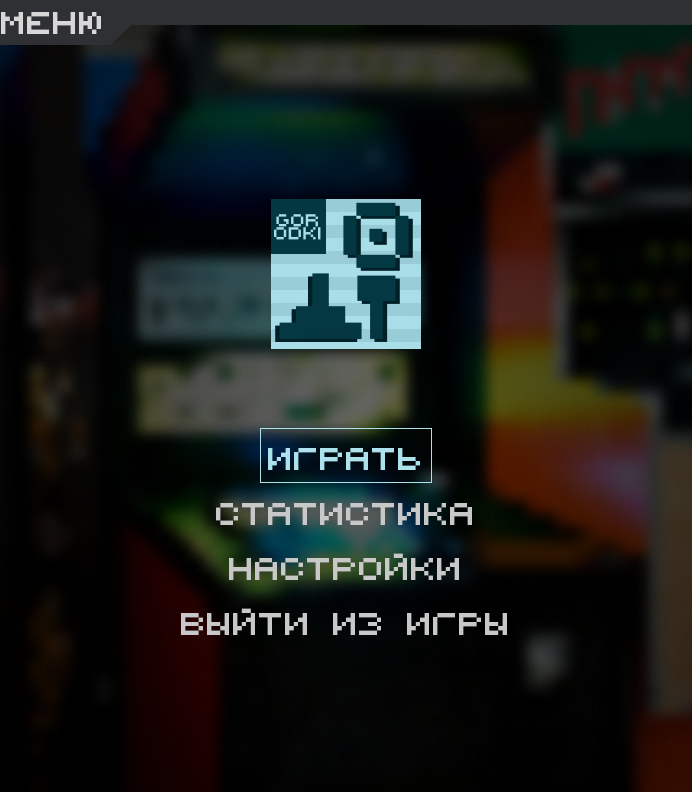
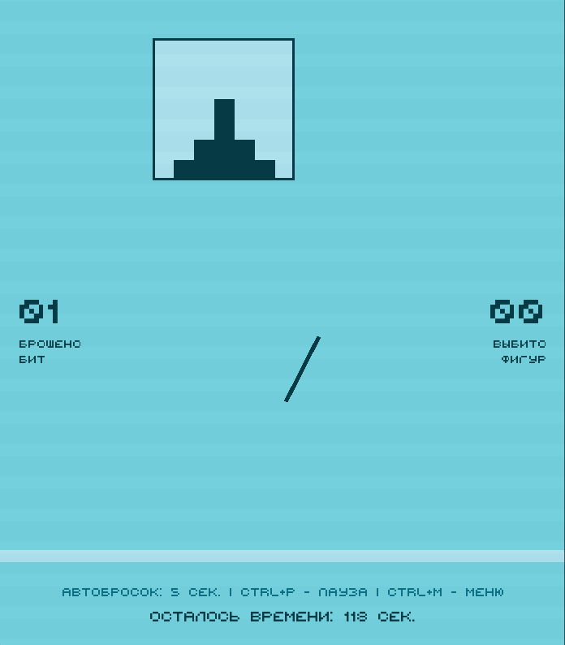
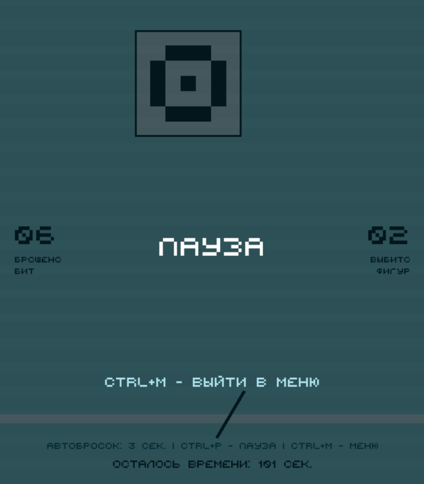
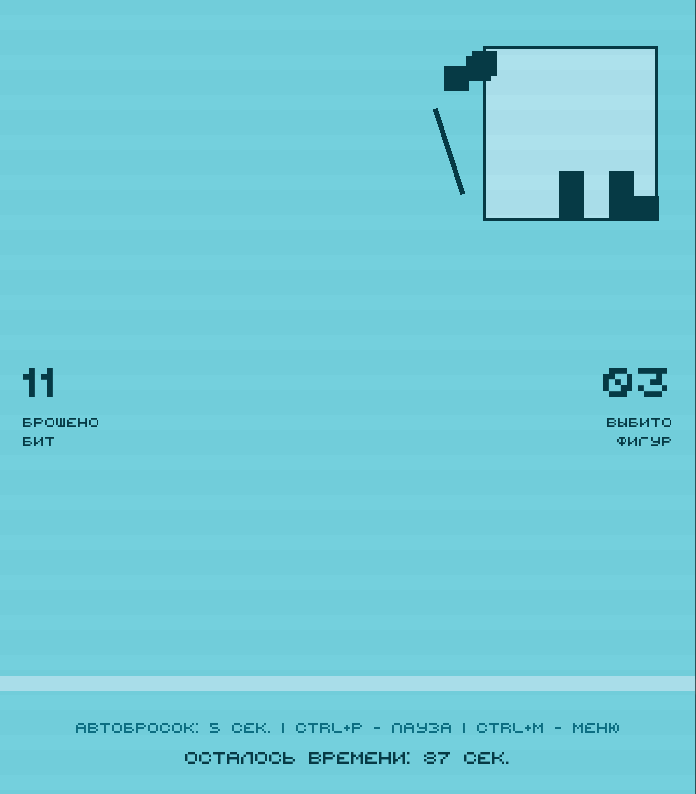

# Игра "Городки"

> [!IMPORTANT]
> 💛 Итоговый проект по разделу PyGame в Яндекс Лицей

---

## 📜 Описание
**Городки** — это интересная игра, суть которой - выбить бросками бит фигуры за пределы игрового поля. Игрок управляет всего 
тремя клавишами: стрелками (влево и вправо) и пробелом (либо стрелкой вверх), подгадывая нужный момент для броска. Если фигура
сбита не полностью, она выводится повторно, при этом бита переходит на линию ближе к фигуре. Нужно быть внимательным: на прицел есть только 5 секунд.
Если не нажать на кнопку, бита выбрасывается автоматически.

**Задача игрока** — затратить на выбивание 15 фигур как можно меньше бросков и набрать как можно больше очков. Если 
сбить все фигуры, потратив не более 30 бит, выпадет бонусная игра. (бонусная игра представляет собой дополнительный уровень
с фигурой, но за ее прохождение начисляются дополнительные очки)

Чтобы игра была более интересной, в ней будут модификаторы, которые усложнят или облегчат игру. Таким образом, уровни 
будут отличаться друг от друга. В каждом уровне будет написано, какой модификатор используется (если не написано, значит никакой не используется),
но не будет указана его характеристика. (Изначально в игре выключены модификаторы, включить их можно в настройках)

*Перед броском есть задержка 0.3 сек.*

### Модификаторы

| Название                    | Описание                                                                              |
|-----------------------------|---------------------------------------------------------------------------------------|
| Ускорение                   | Ускоряет биту/фигуру (от 1.05x до 1.8x)                                               |
| Замедление                  | Замедляет биту/фигуру (от 0.6x до 0.9x)                                               |
| Бита с бомбой               | Бита имеет эффект бомбы, что позволяет разрушить фигуру за 1 попадание                |
| Движение биты под углом     | Бита будет лететь под углом (от 70° до 110°)                                          |
| Барьер                      | На поле есть движущийся барьер, который препятствует бите успешно долететь до фигуры  |
| Увеличение игрового времени | У вас становиться больше времени на сбитие фигур (от 1.1x до 1.3x)                    |
| Уменьшение игрового времени | Поспешите! Теперь у вас гораздо меньше времени на сбитие всех фигур (от 0.7x до 0.9x) |
| Неизменяемая линия запуска  | Линия запуска биты не меняется                                                        |
| Укорочение/удлинение биты   | Укорочает или удлиняет биту (от 0.75x до 1.25x)                                       |

---

## 📝 Техническое задание

### 🐍 PyGame
- Окна:
  - Стартовое меню:
    - Кнопки:
      - [x] Начать игру
      - Статистика
      - Настройки:
        - [x] Регулировка громкости игры
        - [x] Вкл./выкл. модификаций
      - [x] Выход из игры
  - [x] Результат игры
  - [x] Пауза
- Поле:
  - [x] Поле для фигуры
- Фигуры:
  - [x] 16 различных фигур
  - [x] Взаимодействие с фигурами
  - [x] Звук столкновения фигур
- Линия запуска:
  - [x] Изменение положения линии запуска
- Различные модификаторы:
  - [x] Добавить модификаторы (1-9)
- Бита:
  - Управление:
    - [x] Бросок
    - [x] Передвижение
    - [x] Небольшая задержка перед след. броском
  - Анимации и эффекты:
    - [x] Бита крутиться вокруг себя
    - [x] Мерцание биты при появлении
  - Звук:
    - [x] Звук при броске биты
- Эффекты:
  - [x] Партиклы
  - [x] Добавить ретро-эффект поверх всех слоёв

- 🐞 Исправление багов/недочетов:
  - [x] Накладывание фигур друг на друга при выходе в меню
  - [x] Наложение текста друг на друга при переводе на другую строку (при is_center=True)
  - [x] Исправление бесконечного звука биты при выходе в меню

*P.S. Звуки могут быть не очень приятным: они взяты из оригинальной игры :)*

### 🪶 SQLite

- Таблица **passing** (прохождения)

|          | id                     | score             | figuresKnocked           | totalBitsThrown                | bonusLevelPassed            | secondsTimeSpent                        | gameModifiersId                                                             | createdAt           |
|----------|------------------------|-------------------|--------------------------|--------------------------------|-----------------------------|-----------------------------------------|-----------------------------------------------------------------------------|---------------------|
| Описание | ID игры                | Общий счёт (очки) | Количество выбитых фигур | Общее количество брошенных бит | Пройден ли бонусный уровень | Сколько секунд затрачено на прохождение | ID всех используемых модификаторов в игре в порядке возрастания (от 1 до 9) | Время создания игры |
| Свойства | PK, INT, AUTOINCREMENT | INT, NOT NULL     | INT, NOT NULL            | INT, NOT NULL                  |  BOOLEAN, NOT NULL          | INT, NOT NULL                           | VARCHAR(50)                                                                 | TIMESTAMP, NOT NULL |

- Таблица **settings** (настройки)

|          | id                     | gameVolume                 | gameWithModifiers           |
|----------|------------------------|----------------------------|-----------------------------|
| Описание | ID настройки           | Громкость игры (от 0 до 1) | Игра с модификаторами (0/1) |
| Свойства | PK, INT, AUTOINCREMENT | FLOAT, NOT NULL            | BOOLEAN, NOT NULL           |

- Взаимодействие с БД:
  - Добавление данных:
    - [x] Добавление в БД статистики игры
  - Получение данных:
    - [x] Статистика за всё время
    - [x] Статистика за конкретную игру
    - [x] Лучший результат
  - Изменение данных:
    - [x] Изменение поля game
    - [x] Вкл./выкл. модификаций

---

## 📃 Пояснительная записка

### Проект: название и автор
**Название игры:** Городки (Gorodki) 
**Автор:** Кирушев Кирилл

### Описание идеи
**Городки** — это игра, суть которой - выбить бросками бит фигуры за пределы игрового поля, при этом игрок должен затратить
на выбивание 15-ти фигур как можно меньше бросков и набрать как можно больше очков.  Данная игра позволяет игроку проверить
свою интуицию и точность.

### Описание реализации
В проекте используется объектно-ориентированная парадигма программирования: игра полностью состоит из объектов, каждый из
которых имеет свою характеристику и свойства, тем самым, все эти параметры можно редактировать. Благодаря такому подходу
оригинальная игра была видоизменена: в нее были добавлены различные модификаторы, применяемые к игровым объектам. Такое
видоизменение игры делает ее более интересной с фактором случайности.

Для проверок столкновений используются маски объектов. Причем маска биты особенная: она изменяется по ходу движения биты
в зависимости от расположения и формы отрисовки биты. Такое решение сделает попадание биты более реалистичным, а также
немного усложнит игру.

В игре есть подсчет очков, он учитывает такие параметры, как: количество брошенных бит, количество сбитых фигур и их частей,
оставшиеся время, количество пройденных уровней, прохождение бонусной игры. Игрок всегда может посмотреть свою статистику
по каждой из игр. Самый лучший результат (и номер игры, где он сделан) находится сверху.

### Технологии
| Модуль       | Описание                                                                            | Встроенный |
|--------------|-------------------------------------------------------------------------------------|------------|
| pygame       | основной модуль для создания игры                                                   | нет        |
| pygame-menu  | дополнение к основному модулю pygame для реализации меню в игре                     | нет        |
| pyinstaller  | с помощью этого модуля игру можно будет запускать через .exe-файл                   | нет        |
| cachetools   | модуль необходим для регуляции количества одновременно играющих звуков              | нет        |
| sqlite3      | модуль для счёта статистики игрока                                                  | да         |
| random       | модуль для добавления случайностей в игре, что делает процесс игры более интересным | да         |
| sys          | необходим для завершения программы                                                  | да         |

### Скрины

---

## Презентация проекта
Ссылка на [папку с презентацией](https://drive.google.com/drive/folders/1ibC5eJ1ScqhlVO6dl-X3i0lg-aI_55FM?usp=sharing)
